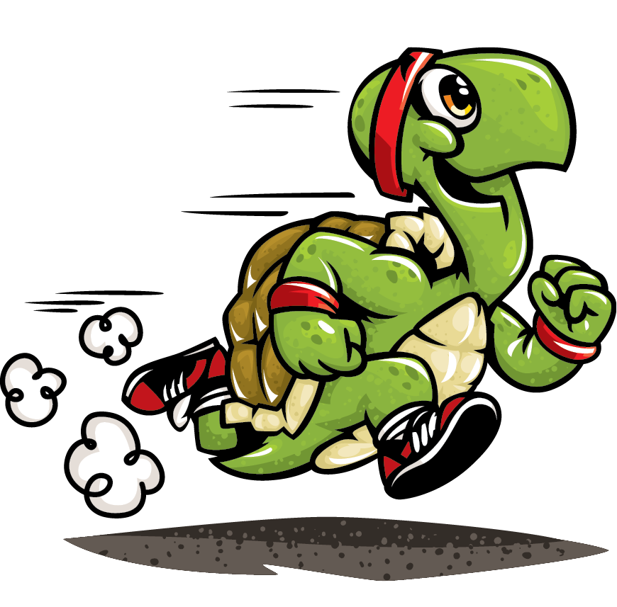

# <u>**Turtle Racing Project**</u>

## A betting game on turtle race between 6 turtles created with turtle graphics library in python.    
    
### <u>**Libraries used:**</u>  
Turtle graphics  
### <u>**Project:**</u>  
Hirst Painting Project  
100 Days of Code - The Complete Python Pro Bootcamp 2021  
Day 19 - Intermediate - Instances, State and Higher Order Functions